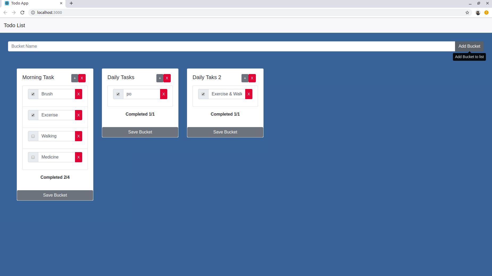

Made using React (16.13.1) and Django (3.1)

# Dependencies
1) React Bootstrap
2) Django restframework
3) corsheaders for django (for cors between 3000 port and 8000 port)

# To start the application
1) Install react, django and required dependencies mentioned above
2) Make Migration in django (command: 'python3 manage.py makemigrations' inside django folder)
3) Migrate to create tables (command: 'python3 manage.py migrate' inside django folder)
4) Start Django server (command: 'python3 manage.py runserver' inside django folder)
5) Start React Application (command: 'npm start' inside React folder)

# Screenshot of application

